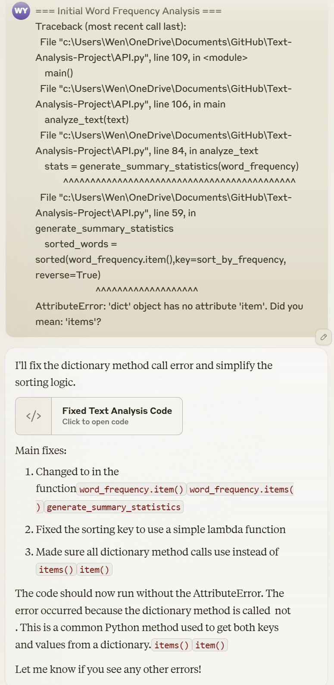

# Text-Analysis-Project
**1. Project Overview** (~1 paragraph)

For this project, I analyzed F. Scott Fitzgerald's The Great Gatsby in particular, using the Project Gutenberg digital library as the primary data source. I used Characterizing by Word Frequencies,Computing Summary Statistics and Removing Stop words to understand the linguistic patterns of the novel. The main goal was to create a Python program that would analyze the textual content and reveal word usage patterns to help better understand the author's writing style and lexical choices.

**2. Implementation** (~1-2 paragraphs)

The system architecture is composed of four key components: URL-based text downloading from Project Gutenberg using urllib; removing boilerplate content and handling punctuation; processing word frequency and generating statistical summaries; and removing common English stop words.

In my design, I chose the character replacement method because strip() only removes characters from the beginning and end of a string, whereas replacement can handle punctuation in words. This is important for correctly handling abbreviations and embedded punctuation. For GenAI help, I use Claude to debug syntax errors in dictionary methods and to help me understand proper text cleanup techniques

**3. Results** (~1-3 paragraphs + figures/examples)

The initial word frequency analysis showed that the text contained a total of 8,604 words, including 460 unique words. On average, each word occurs about 18.7 times. The most common words include common stop words such as “the”, “of”, “and”, and “in”. “The word “the” appeared 468 times, indicating that structural words are usually prominent in English texts. After deleting the common English stop words, words like “that”, “this”, “my” and “it “ such words appear most frequently. This suggests a reflective or descriptive tone that may involve narration or introspection.!
[alt text](image-1.png)

**4. Reflection** (~1-2 paragraphs)

Its main advantage was showing me how to get data from different places and how to program the text, which made it smooth for me to guide the data upfront. The biggest challenge was getting the text cleanup right, especially punctuation and case sensitivity. These areas required careful attention to ensure accurate word frequency calculations.

Through this project, I gained valuable hands-on experience with Python dictionaries and string manipulation, and further realized the importance of thorough text preprocessing to ensure meaningful analysis results. I found the use of the GenAI tools to be particularly beneficial for debugging and provided insights into best practices that deepened my understanding. In future projects, I will prioritize a more structured testing strategy and incorporate error handling early on to make the development process smoother. In the future, I plan to add support for multi-text analytics, implement more advanced analytics, and create visualization methods for greater insight into results.
